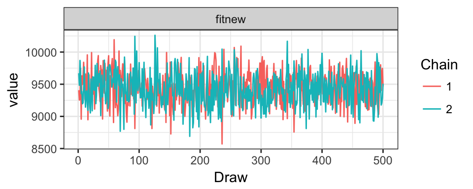

# Beta


```
## [1] "Run Completed at 2017-11-20 12:58:26"
```


```r
#reload if needed
load("ObservedModel.RData")
```

#Load in data


```r
#read in flower morphology data, comes from Nectar.R
fl.morph<-read.csv("data/FlowerMorphology.csv")

#use effective corolla where possible.
fl.morph$Corolla<-fl.morph$EffectiveCorolla

fl.morph[is.na(fl.morph$Corolla),"Corolla"]<-fl.morph[is.na(fl.morph$Corolla),"TotalCorolla"]

#fuchsia macrostigma has an undue influence on this analysis, being 3x longer than other flowers, its not clear that birds really have to reach down the full corolla lenghth, use effective corolla length.
#fl.morph[fl.morph$Group.1 %in% "Fuchsia macrostigma","Corolla"]<-50

#First row is empty
fl.morph<-fl.morph[-1,]

#Bring in Hummingbird Morphology Dataset, comes from
hum.morph<-read.csv("data/HummingbirdMorphology.csv")

#taxonomy change, we are calling them Crowned Woodnymph's now.
hum.morph$English<-as.character(hum.morph$English)

hum.morph$English[hum.morph$English %in% "Green-crowned Woodnymph"]<-"Crowned Woodnymph"

#Bring in Interaction Matrix
int<-read.csv("data/HummingbirdInteractions.csv")

int$timestamp<-as.POSIXct(paste(int$Time,int$DateP),format="%H:%M:%S %Y-%m-%d")

#one date error
int[int$DateP %in% '2013-07-25',"Month"]<-7

#one duplicate camera error, perhaps two GPS records.
int<-int[!(int$ID %in% "FH1108" & int$Date_F %in% '2014-12-01'),]

#Correct known taxonomic disagreements, atleast compared to traits
int[int$Iplant_Double %in% "Onagaraceae fuschia","Iplant_Double"]<-"Fuchsia macrostigma"
int[int$Iplant_Double=="Alloplectus purpureus","Iplant_Double"]<-"Glossoloma purpureum"
int[int$Iplant_Double=="Capanea affinis","Iplant_Double"]<-"Kohleria affinis"
int[int$Iplant_Double=="Columnea cinerea","Iplant_Double"]<-"Columnea mastersonii"
int[int$Iplant_Double=="Alloplectus teuscheri","Iplant_Double"]<-"Drymonia teuscheri"
int[int$Iplant_Double=="Drymonia collegarum","Iplant_Double"]<-"Alloplectus tetragonoides"

#Some reasonable level of presences, 4 points
keep<-names(which(table(int$Hummingbird) > 4))

#int<-int[int$Hummingbird %in% keep & !int$Hummingbird %in% c("Sparkling Violetear"),]

m.dat<-droplevels(int[colnames(int) %in% c("ID","Video","Time","Hummingbird","Sex","timestamp","TransectID","Transect_R","Iplant_Double","Pierce","DateP","Month","ele","Type")])

#Does the data come from camera or transect?
m.dat$Type<-(is.na(m.dat$TransectID))*1

m.dat$Year<-years(as.Date(m.dat$DateP))

#one missing date
m.dat$Year[m.dat$Year %in% 2012]<-2013
m.dat$Year[m.dat$Year %in% 2106]<-2016

#Number of bird species
h_species<-nlevels(m.dat$Hummingbird)

#Number of plant species
plant_species<-nlevels(m.dat$Iplant_Double)

#Get english name
dath<-merge(m.dat,hum.morph, by.x="Hummingbird",by.y="English",keep=all)

#Merge to flowers
int.FLlevels<-levels(factor(dath$Iplant_Double))

#Which flowers are we missing info for?
missingTraits<-int.FLlevels[!int.FLlevels %in% fl.morph$X]

#print(paste("Missing Trait Information:",missingTraits))
dath<-merge(dath,fl.morph, by.x="Iplant_Double",by.y="X")

#Drop piercing events, since they don't represent correlation
#dath<-dath[!dath$Pierce %in% c("y","Y"),]
```

##Match Species to Morphology


```r
#observed traitmatching
traitmatchF<-abs(t(sapply(hum.morph$Bill,function(x){x-fl.morph$Corolla})))
rownames(traitmatchF)<-hum.morph$English
colnames(traitmatchF)<-fl.morph$Group.1
```


```r
#match names #Round to 2 decimals #Convert to cm for winbugs, avoids numerical underflow
traitmatchT<-round(traitmatchF[rownames(traitmatchF) %in% dath$Hummingbird,colnames(traitmatchF) %in% dath$Iplant_Double],2)
traitmatchT<-traitmatchT[sort(rownames(traitmatchT)),sort(colnames(traitmatchT))]
```

##Elevation ranges

Create a binary variable whether each observation was in a low elevation or high elevation transect. We have some species that just occur at the top of the gradient, and are not present in the sampling window of flowers at the low elevation.

Accounting for non-availability.
We have to figure out which plants were sampled in which periods, and if it was sampled, the non-detection are 0 if it wasn't the non-detection are NA. then remove all the Na's.


```r
elevH<-read.csv("data/HummingbirdElevation.csv",row.names=1)
head(elevH)
```

```
##                 Hummingbird    Low        m   High Index
## 1    White-whiskered Hermit 1340.0 1397.917 1606.4     1
## 2            Andean Emerald 1370.0 1416.417 1588.5     1
## 3    Stripe-throated Hermit 1360.0 1420.425 1640.0     1
## 4 Rufous-tailed Hummingbird 1368.5 1430.636 1690.0     1
## 5         Crowned Woodnymph 1343.5 1466.714 2300.0     1
## 6  Wedge-billed Hummingbird 1331.0 1616.850 2038.5     3
```

```r
colnames(elevH)[5]<-"Elevation"
elevH$Bird<-1:nrow(elevH)

#high elevation or low elevation
elevP<-read.csv("data/PlantElevation.csv",row.names=1)
colnames(elevP)[5]<-"Elevation"
elevP$Plant<-1:nrow(elevP)
elevP$Iplant_Double<-as.character(elevP$Iplant_Double)

#Merge to observed data
#plants
dathp<-merge(dath,elevP,by="Iplant_Double")

#birds
datph<-merge(dathp,elevH,by="Hummingbird")
```

What elevation transect is each observation in?
The camera data need to be inferred from the GPS point.


```r
#cut working best on data.frame
datph<-as.data.frame(datph)

#which elevation bin is each observation within
labs<-paste(seq(1300,2500,200),seq(1500,2700,200),sep="_")

#for the couple points that have 1290 elevation, round up to 300 for convienance
datph$ele[datph$ele < 1300]<-1301
datph$ele<-as.numeric(datph$ele)
datph$Transect_R[is.na(datph$Transect_R)]<-as.character(cut(datph[is.na(datph$Transect_R),]$ele,seq(1300,2700,200),labels=labs))

#Elev for the transects is the midpoint
tran_elev<-datph[datph$Survey_Type=='Transect',"Transect_R"]
datph[datph$Survey_Type=='Transect',"ele"]<-sapply(tran_elev,function(x){
  mean(as.numeric(str_split(x,"_")[[1]]))
})
```

### Define Time Events


```r
#ID for NA is holger transects, make the id's 1:n for each day of transect at each elevation, assuming no elevation was split across days.
datph$ID<-as.character(datph$ID)
noid<-datph[is.na(datph$ID),]

id_topaste<-paste(noid$Month,noid$Year,"Transect",sep="_")
datph[which(is.na(datph$ID)),"ID"]<-id_topaste

#Create year month combination
datph$Time<-paste(datph$Month,datph$Year,sep="_")

#Label survey type
datph$Survey_Type<-NA

mt<-!is.na(datph$TransectID)*1
datph$Survey_Type[mt==1]<-"Transect"
datph$Survey_Type[!datph$Survey_Type %in% "Transect"]<-"Camera"

datph<-datph[datph$Survey_Type=="Camera",]

#time filter

#sort by timestamp
datph<-datph[order(datph$timestamp),]

dotime<-function(d){
  d$Timediff<-NA
  if(nrow(d)>1){
  for (x in 2:nrow(d)){
  d$Timediff[x]<-difftime(d$timestamp[x],d$timestamp[x-1],units="mins")  
  }
  }
  return(d)
}

datph<-datph %>% group_by(ID,Hummingbird) %>% do(dotime(.))

#eliminate interaction by the same species within five minutes
datph<-datph[!1:nrow(datph) %in% which(datph$Timediff<5),]
#Day level
#add day ID
sdat<-split(datph,list(datph$ID),drop = T)

sdat<-lapply(sdat,function(x){
  x<-droplevels(x)
  x$Day<-as.numeric(as.factor(x$DateP))
  return(x)
})

indatraw<-rbind_all(sdat)

#Species names
for (x in 1:nrow(indatraw)){
  indatraw$Hummingbird[x]<-as.character(elevH[elevH$Bird %in% indatraw$Bird[x],"Hummingbird"])
  indatraw$Iplant_Double[x]<-as.character(elevP[elevP$Plant %in% indatraw$Plant[x],"Iplant_Double"])
}

#match the traits
traitmelt<-melt(traitmatchT)
colnames(traitmelt)<-c("Hummingbird","Iplant_Double","Traitmatch")

#dummy presence variable
indatraw$Yobs<-1

#prune columsn to make more readable
indatraw<-indatraw[,c("Hummingbird","Iplant_Double","ID","Time","Month","Year","Transect_R","ele","DateP","Yobs","Day","Survey_Type","Pierce")]
```

##Summarize daily interactions
To estimate the daily detectability, there can only be a max of one interaction per day.
We use mean elevation to average across observations within a transect

```r
indatraw<-indatraw %>% group_by(Hummingbird,Iplant_Double,ID,Day) %>% summarize(Yobs=sum(Yobs),Time=unique(Time),Transect_R=unique(Transect_R),Month=unique(Month),Year=unique(Year),ele=mean(ele),DateP=unique(DateP),Survey_Type=unique(Survey_Type)) %>% ungroup()
```


```r
indat<-prepData(indatraw)
```

#Hierarchical Model

For hummingbird species i feeding on plant species j observed at time k and sampling event observed by transect 

Observation Model:

$$ Yobs_{i,j,k,d} \sim Binomial(N_{i,j,k},\omega) $$

Process Model:

$$ N_{i,j,k} \sim Binomial(\lambda_{i,j,k}) $$
$$ logit(\lambda_{i,j,k}) = \alpha_i + \beta_{1,i} * Traitmatch_{i,j} $$

**Priors**

$$\phi \sim Normal(0,0.386) $$

$$ \alpha_i \sim Normal(\alpha_\mu,\alpha_\tau)$$
$$ \beta_{1,i} \sim Normal(\mu_{\beta_1,\tau_{beta_1}})$$

Group Level Logit Transformed Means
$$ \mu_\alpha \sim Normal(0,1.67)$$

$$ \mu_{\beta_1} \sim Normal(0,1.67)$$

Group Level Variance
$$ \tau_{\alpha} \sim Half cauchy(0,1,1)$$

$$ \tau_{\beta_1} \sim Half cauchy(0,1,1)$$


```r
#Source model
source("models/TraitMatchPoisson.R")
  
#print model
writeLines(readLines("models/TraitMatchPoisson.R"))
```

```
## sink("models/TraitMatchPoisson.jags")
## cat("
##     model {
##     
##     for (x in 1:Nobs){
##     
##     log(lambda[x]) <- alpha[Bird[x]] + beta1[Bird[x]] * Traitmatch[Bird[x],Plant[x]] 
##     N[x]~dpois(lambda[x])
##     Yobs[x] ~ dbin(detect[Bird[x]],N[x])
##     
##     #Observed discrepancy
##     E[x]<-abs(Yobs[x]- N[x])/Nobs
##     }
##     
##     #Assess Model Fit - Predict remaining data
##     for(x in 1:Nnewdata){
##     
##     #Generate prediction
##     log(lambdanew[x])<-alpha[NewBird[x]] + beta1[NewBird[x]] * Traitmatch[NewBird[x],NewPlant[x]] 
##     Nnew[x]~dpois(lambdanew[x])
##     Ynew_pred[x]~dbin(detect[NewBird[x]],Nnew[x])
##     
##     #Assess fit, proportion of corrected predicted links
##     E.new[x]<-abs(Ynew[x]-Ynew_pred[x])/Nnewdata
##     
##     }
##     
##     #Priors
##     #Observation model
##     #Detect priors, logit transformed - Following lunn 2012 p85
##     
##     for(x in 1:Birds){
##     logit(detect[x])<-dcam[x]
##     dcam[x]~dnorm(omega_mu,omega_tau)
##     }
##     
##     #Process Model
##     #Species level priors
##     for (i in 1:Birds){
##     
##     #Intercept
##     #logit prior, then transform for plotting
##     alpha[i] ~ dnorm(alpha_mu,alpha_tau)
##     
##     #Traits slope 
##     beta1[i] ~ dnorm(beta1_mu,beta1_tau)    
##     
##     }
##     
##     #OBSERVATION PRIOR
##     omega_mu ~ dnorm(0,0.386)
##     omega_tau ~ dunif(0,10)
##     
##     #Group process priors
##     
##     #Intercept 
##     alpha_mu ~ dnorm(0,0.386)
##     alpha_tau ~ dt(0,1,1)I(0,)
##     alpha_sigma<-pow(1/alpha_tau,0.5) 
##     
##     #Trait
##     beta1_mu~dnorm(0,0.386)
##     beta1_tau ~ dt(0,1,1)I(0,)
##     beta1_sigma<-pow(1/beta1_tau,0.5)
##     
##     #derived posterior check
##     fit<-sum(E[]) #Discrepancy for the observed data
##     fitnew<-sum(E.new[])
##     
##     }
##     ",fill=TRUE)
## sink()
```

```r
#Cut Model into timeslives
indat<-indat %>% arrange(DateP)
indat$interval<-cut(as.POSIXct(indat$DateP),7)
indat$jinterval<-as.numeric(indat$interval)
intervals<-unique(indat$jinterval)

chains<-list()
traitfit<-list()
nets<-list()
predicted<-list()

#predict up to the final interval

for (x in 1:(length(intervals)-1)){
  
  #Run Model
  mod<-runModel(indat=indat,interval=intervals[x],traitmatchT = traitmatchT)
  
  #Get Chains
  chains[[x]]<-data.frame(getChains(mod),interval=intervals[x])
}
```

```
## Compiling model graph
##    Resolving undeclared variables
##    Allocating nodes
## Graph information:
##    Observed stochastic nodes: 1627
##    Unobserved stochastic nodes: 11365
##    Total graph size: 52922
## 
## Initializing model
## 
## Compiling model graph
##    Resolving undeclared variables
##    Allocating nodes
## Graph information:
##    Observed stochastic nodes: 2629
##    Unobserved stochastic nodes: 10363
##    Total graph size: 51920
## 
## Initializing model
## 
## Compiling model graph
##    Resolving undeclared variables
##    Allocating nodes
## Graph information:
##    Observed stochastic nodes: 3393
##    Unobserved stochastic nodes: 9599
##    Total graph size: 51156
## 
## Initializing model
## 
## Compiling model graph
##    Resolving undeclared variables
##    Allocating nodes
## Graph information:
##    Observed stochastic nodes: 4060
##    Unobserved stochastic nodes: 8932
##    Total graph size: 50489
## 
## Initializing model
## 
## Compiling model graph
##    Resolving undeclared variables
##    Allocating nodes
## Graph information:
##    Observed stochastic nodes: 4419
##    Unobserved stochastic nodes: 8573
##    Total graph size: 50130
## 
## Initializing model
## 
## Compiling model graph
##    Resolving undeclared variables
##    Allocating nodes
## Graph information:
##    Observed stochastic nodes: 5155
##    Unobserved stochastic nodes: 7837
##    Total graph size: 49394
## 
## Initializing model
```

```r
alldat<-bind_rows(chains)

head(alldat)
```

```
##   parameter Draw Chain    estimate species      par plant interval
## 1  alpha_mu    1     1 -0.05895424      NA alpha_mu    NA        1
## 2  alpha_mu    2     1 -0.08237245      NA alpha_mu    NA        1
## 3  alpha_mu    3     1 -0.16516721      NA alpha_mu    NA        1
## 4  alpha_mu    4     1  0.15337286      NA alpha_mu    NA        1
## 5  alpha_mu    5     1 -0.03414693      NA alpha_mu    NA        1
## 6  alpha_mu    6     1  0.32167489      NA alpha_mu    NA        1
```

##Assess Convergence


```r
###Chains
ggplot(alldat[alldat$par %in% c("alpha_mu","beta1_mu"),],aes(x=Draw,y=estimate,col=as.factor(Chain))) + geom_line() + facet_grid(par~interval,scale="free") + theme_bw() + labs(col="Chain") 
```


```r
#ggplot(alldat[alldat$par %in% c("detect"),],aes(x=Draw,y=estimate,col=as.factor(Chain))) + geom_line() + facet_wrap(species~interval,scale="free",ncol=3) + theme_bw() + labs(col="Chain") + ggtitle("Species Level")
```


```r
ggplot(alldat[alldat$par %in% c("beta1_mu","beta1_sigma","alpha_mu","alpha_sigma"),],aes(x=Draw,y=estimate,col=as.factor(Chain))) + geom_line() + theme_bw() + labs(col="Chain") + ggtitle("Group Level Parameters") + facet_wrap(~par,scales="free")
```


#Posteriors

## Strength of trait-matching


```r
###Posterior Distributions
ggplot(alldat[alldat$par %in% c("beta1_mu"),],aes(x=as.factor(interval),y=estimate)) + geom_violin(position='identity',fill="black")  + theme_bw() + labs(x="Date") + scale_x_discrete(labels=unique(indat$interval))
```


## Model fit


```r
sumfit<-alldat[alldat$par %in% c("fitnew"),] %>% group_by(interval) %>% summarize(mean=mean(estimate),lower=quantile(estimate,0.05),upper=quantile(estimate,0.95))

ggplot(sumfit,aes(x=as.factor(interval),y=mean)) + geom_point()+ geom_ribbon(aes(ymax=upper,ymin=lower,group=1),alpha=0.2)  + theme_bw() + labs(x="Date",y="Prediction residuals") + scale_x_discrete(labels=unique(indat$interval))
```



##Discrepancy 

The goodness of fit is a measured as chi-squared. The expected value for each day is the detection rate * the estimate intensity of interactions. The expected value is compared to the observed value of the actual data. In addition, a replicate dataset is generated from the posterior predicted intensity. Better fitting models will have lower discrepancy values and be 
Better fitting models are smaller values and closer to the 1:1 line. A perfect model would be 0 discrepancy. This is unrealsitic given the stochasticity in the sampling processes. Rather, its better to focus on relative discrepancy. In addition, a model with 0 discrepancy would likely be seriously overfit and have little to no predictive power.


```r
fitstat<-alldat[alldat$par %in% c("fit","fitnew"),]
fitstat<-dcast(fitstat,interval+Draw+Chain~par,value.var="estimate")

ymin<-round(min(fitstat$fit))
ymax<-round(max(fitstat$fit))
ab<-data.frame(x=0:ymax,y=0:ymax)
disc_obs<-ggplot(fitstat,aes(x=fit,y=fitnew,col=as.factor(interval))) + geom_point() + theme_bw() + labs(x="Observed Residuals",y="Prediction residuals",col="Date")  + ggtitle("Posterior predictive check")  + scale_color_brewer(labels=unique(indat$interval),palette = "RdBu") 
disc_obs
```


```r
#Bayesian p-value
sum(fitstat$fitnew>fitstat$fit)/nrow(fitstat)
```

```
## [1] 0.394
```

```r
ggsave("Figures/ObservedDiscrepancy.jpeg",width = 5,height=10)
```

#Predicted Relationship 


```r
#Expand out pars
castdf<-dcast(pars_detect[pars_detect$par %in% c("beta1_mu","alpha_mu"),], Chain + Draw~par,value.var="estimate")
```

## Posterior prediction


```r
#Trajectories from posterior
predy<-trajF(alpha=castdf$alpha_mu,beta1=castdf$beta1_mu,trait=indat$Traitmatch)

ggplot(data=predy,aes(x=trait)) + geom_ribbon(aes(ymin=lower,ymax=upper),alpha=0.4,fill="red")  +  theme_bw() + ylab("Interactions") + xlab("Difference between Bill and Corolla Length") + geom_point(data=indat,aes(x=Traitmatch,y=Camera)) + geom_line(aes(y=mean)) + geom_point(data=indat,aes(x=Traitmatch,y=Transect)) 
```


```r
save.image("ObservedModel.RData")
```
